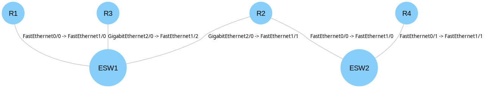

# Sentry-Labs-JR7

> The network-engineering journey behind **Sentry-Pod** — a containerised, AI-powered Network
> Management System (NMS) for Cisco-centric environments, built on the principles of Intent-Based
> Networking (IBN).

This repository is my personal documentation of the **network engineering side** of a
5-person capstone project. It is a chronological journal: 19 working days, preserved as they
happened — problems, failures, dead ends, and fixes included. No polish, no rewrite.

---

## From zero to "competent rookie"

Day 1: a GNS3 router that won't let a modern laptop SSH into it.
Day 19: a self healing three tier network and a single Ansible command that configures all 16 devices in the topology.

I'm not claiming to be an expert. This is the honest record of the climb.

| Day | Topic | The Struggle | Read |
| --- | ----- | ------------ | ---- |
| 01 | Router Init and First Contact | Legacy IOS refuses modern SSH crypto — bypassed from an Alpine container | [Day 01](docs/journal/01-router-init-and-first-contact.md) |
| 02 | Persistent Environment | Throwaway containers re-downloading 378 MiB every run | [Day 02](docs/journal/02-persistent-environment.md) |
| 03 | Golden State Baseline | Harvesting and exporting the running config; DHCP is a lease bomb | [Day 03](docs/journal/03-golden-state-baseline.md) |
| 04 | Three-Tier Topology & VLSM | First real topology, subnetted the right way | [Day 04](docs/journal/04-topology-three-tier-vlsm.md) |
| 05 | Topology Update | Extending the network; SSH on every router | [Day 05](docs/journal/05-topology-update.md) |
| 06 | Dynamic Routing with OSPF | Why static routes don't scale | [Day 06](docs/journal/06-ospf-dynamic-routing.md) |
| 07 | AI Implementation (LLM Showdown) | 3 of 4 LLMs hallucinate Cisco CLI; DeepSeek-R1 wins | [Day 07](docs/journal/07-ai-implementation-llm-showdown.md) |
| 08 | Topology Redesign — Spine-Leaf | The old "three-tier" was a lie; redesign with VLSM | [Day 08](docs/journal/08-topology-redesign-spine-leaf.md) |
| 09 | Ansible Day 1 | First playbook; idempotency clicks | [Day 09](docs/journal/09-ansible-first-playbook.md) |
| 10 | Access Layer and L2 Connectivity | VLANs, trunks, SVIs, HSRP — by hand | [Day 10](docs/journal/10-access-layer-l2-connectivity.md) |
| 11 | Management VLAN | The "longest match" loopback bug that broke pings | [Day 11](docs/journal/11-management-vlan.md) |
| 12 | Access Layer VLANs via Ansible | 8 switches, 8 VLANs, one playbook | [Day 12](docs/journal/12-access-layer-vlans-ansible.md) |
| 13 | Inter-VLAN Routing via Ansible | The `host_vars` folder pattern | [Day 13](docs/journal/13-inter-vlan-routing-ansible.md) |
| 14 | EtherChannel and Spanning Tree | STP blocks the HSRP-active path — redundancy fights itself | [Day 14](docs/journal/14-etherchannel-and-stp.md) |
| 15 | HSRP and Default Gateways via Ansible | 16 SVIs configured automatically | [Day 15](docs/journal/15-hsrp-default-gateways-ansible.md) |
| 16 | A Universal "Write" Playbook | Saving 16 devices with one command | [Day 16](docs/journal/16-universal-write-playbook.md) |
| 17 | Access Layer Interface Configuration | A typo in `host_vars` — caught by Ansible idempotency | [Day 17](docs/journal/17-access-layer-interface-config.md) |
| 18 | Syslog | Shipping syslog off-box to the host | [Day 18](docs/journal/18-syslog.md) |
| 19 | Redundant Core | Fully self healing layers | [Day 19](docs/journal/19-Redundent-Core.md)

## The network

## Reading guide

Start at **[Day 01](docs/journal/01-router-init-and-first-contact.md)** and read forward.
Every entry links to the next, so the journal reads like a narrative rather than a manual.

- `docs/journal/` — the 18-day record.
- `artifacts/` — the actual code: container files, Netmiko script, and the Ansible playbooks.
- `assets/images/` — topology diagrams and terminal captures referenced by the journal.

## Tech stack

GNS3 · Cisco IOS (EtherSwitch & routers) · Podman (Alpine containers) · Netmiko ·
Ansible · OSPF · VLAN / HSRP / EtherChannel / STP · syslog-ng · HuggingFace LLM API (DeepSeek-R1)

## Security

All credentials in this repository are disposable GNS3 lab credentials. See
[SECURITY.md](SECURITY.md).

## License

[GPL-3.0](LICENSE)
