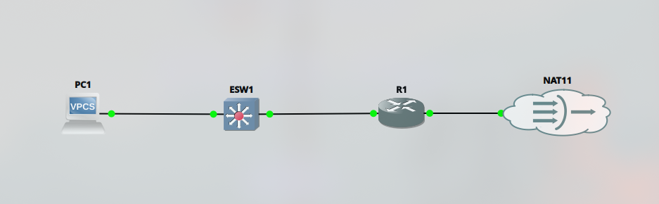
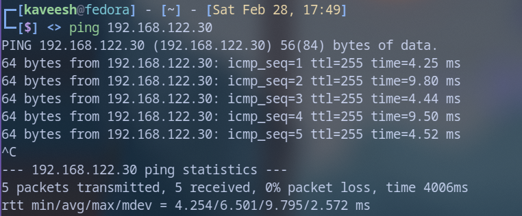
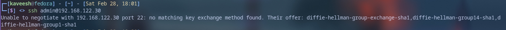
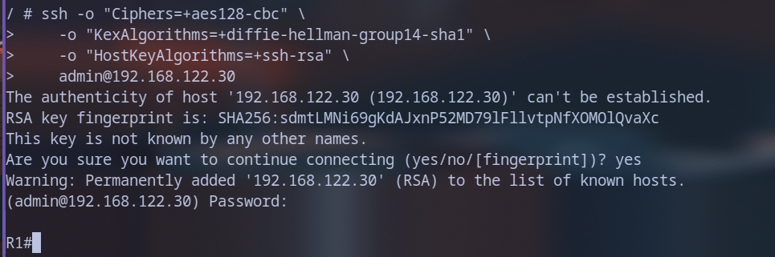

# Day 01 – Router Init and First Contact

> **Date:** 28 Feb 2026 · **Topic:** First contact with the GNS3 lab environment · **Takeaway:** A modern OS and a legacy IOS device fundamentally disagree on how to SSH — and that is a *network administrator's* problem to solve.

[↑ Journal Index](../../README.md)

## The Goal

Initialise the first router in the lab and establish a working management path into it.

## Router setup



- The initial simple topology uses the combination of a gns3 VPC, a layer 2 switch, a router and the gns3 NAT node.
- The NAT node is used to bridge the connection between the virtual gns3 lab environment and the host pc.
- For this topology, the **fa0/1** interface of router **R1** is connected to the **NAT11** node.
- **Fa0/1** is configured to receive an IPv4 address through DHCP.

```text
R1(config-if)#int fa0/1
R1(config-if)#ip address d
R1(config-if)#ip address dhcp
R1(config-if)#no shut
R1(config-if)#
```

```text
R1(config-if)#
*Feb 28 10:53:21.747: %LINK-3-UPDOWN: Interface FastEthernet0/1, changed state to up
*Feb 28 10:53:22.747: %LINEPROTO-5-UPDOWN: Line protocol on Interface FastEthernet0/1, changed state to up
R1(config-if)#^Z
R1#
*Feb 28 10:53:28.127: %SYS-5-CONFIG_I: Configured from console by console
R1#sh ip int br
Interface             IP-Address      OK? Method Status               Protocol
FastEthernet0/0       unassigned      YES unset  administratively down down
FastEthernet0/1       192.168.122.30  YES DHCP   up                   up
FastEthernet1/0       unassigned      YES unset  administratively down down
FastEthernet1/1       unassigned      YES unset  administratively down down
GigabitEthernet2/0    unassigned      YES unset  administratively down down
R1#
*Feb 28 10:53:33.631: %DHCP-6-ADDRESS_ASSIGN: Interface FastEthernet0/1 assigned DHCP address 192.168.122.30, mask 255.255.255.0, hostname R1
```

- As seen in the output, the **Fa0/1** interface has received the /24 IP address 192.168.122.30 through DHCP.

## Initial Ping (ICMP echo)



- The router **R1** was pinged from the host machine with 0% packet loss, indicating that the initial communication between virtual environment and host has been established.

## SSH access

- In order to use **Ansible** to automate operations through playbooks, SSH access needs to be enabled.

### Enable SSH

- On the router **R1**, this is done through;

```text
R1(config)# ip domain-name sentrypod.local
R1(config)#crypto key generate rsa
The name for the keys will be: R1.sentrypod.local
Choose the size of the key modulus in the range of 360 to 4096 for your
 General Purpose Keys. Choosing a key modulus greater than 512 may take
 a few minutes.

How many bits in the modulus [512]: 1024
% Generating 1024 bit RSA keys, keys will be non-exportable...
[OK] (elapsed time was 0 seconds)

R1(config)#
*Feb 28 10:59:46.603: %SSH-5-ENABLED: SSH 1.99 has been enabled
```

- *NOTE!* - As seen here, SSH version 1.99 has been enabled. Current industry best practices mandate that SSH version 2 be used as prior versions are regarded as insecure.

### Create a user for SSH access

```text
R1(config)#username admin privilege 15 secret cisco123
R1(config)#line vty 0 4
R1(config-line)#transport input ssh
R1(config-line)#login local
R1(config-line)#^Z
```

### SSH v2 (Industry Standard)

```text
R1(config)#ip ssh version 2
R1(config)#ip ssh rsa keypair-name SENTRY_KEY
Please create RSA keys to enable SSH (and of atleast 768 bits for SSH v2).
R1(config)#
*Feb 28 11:05:54.727: %SSH-5-DISABLED: SSH 2.0 has been disabled
R1(config)#crypto key generate rsa usage-keys label SENTRY_KEY modulus 2048
The name for the keys will be: SENTRY_KEY

% The key modulus size is 2048 bits
% Generating 2048 bit RSA keys, keys will be non-exportable...
[OK] (elapsed time was 2 seconds)
% Generating 2048 bit RSA keys, keys will be non-exportable...
[OK] (elapsed time was 6 seconds)

R1(config)#
*Feb 28 11:06:20.571: %SSH-5-ENABLED: SSH 2.0 has been enabled
R1(config)#line vty 0 4
R1(config-line)#tansport input ssh
                ^
% Invalid input detected at '^' marker.

R1(config-line)#transport input ssh
R1(config-line)#login local
R1(config-line)#exit
R1(config)#
```

## The Struggle



```text
┌─[kaveesh@fedora] - [~] - [Sat Feb 28, 18:01]
└─[$] <> ssh admin@192.168.122.30
Unable to negotiate with 192.168.122.30 port 22: no matching key exchange method found. Their offer: diffie-hellman-group-exchange-sha1,diffie-hellman-group14-sha1,diffie-hellman-group1-sha1
```

- However, an issue was encountered during the SSH connection phase. A major, common issue that IT professionals in general, in this specific case, Network administrators have to tackle is the existence of legacy systems.
- A large enterprise network could be collection of both current and legacy systems, and a proper NMS must be able to cater to both types.
- In this instance, the IOS image used in the virtual router uses legacy standards, and the host computer running a modern day Operating System (Fedora 43).
- The modern OS cannot communicate over the insecure methods used by the legacy router.
- However, Sentry Pod was designed with device compatibility in mind.

## The Solution

### SSH through podman

- Sentry pod uses podman containers.
- In this situation, a lightweight Alpine Linux container is used.

```bash
# Step 1: Launch a lightweight container with its own crypto library
podman run --rm -it --network=host alpine sh
# Step 2: (Inside the Alpine container) Install the SSH client
apk add openssh-client
```

- Alpine Linux supports legacy bypass flags that Fedora does not.

```bash
# Step 3: Connect using the Legacy Bypass flags
ssh -o "Ciphers=+aes128-cbc" -o "KexAlgorithms=+diffie-hellman-group14-sha1" -o "HostKeyAlgorithms=+ssh-rsa" admin@192.168.122.30
```



- SSH connectivity is successfully established through the user and secret created earlier.

---
← [Day 01 · Start](01-router-init-and-first-contact.md) | [Day 02 · Persistent Environment](02-persistent-environment.md) →
