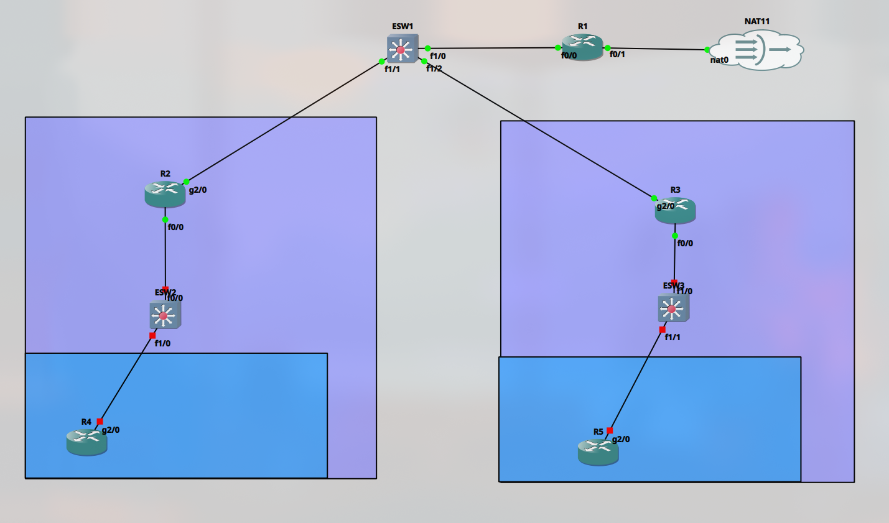

# Day 04 – Topology Update: Three Tier Architecture and VLSM

> **Date:** 05 Mar 2026 · **Topic:** First move past the single-router lab · **Takeaway:** Subnetting isn't an afterthought — VLSM is a design decision made before you cable anything.

[↑ Journal Index](../../README.md)

## The Goal

- With this iteration, the simple topology is upgraded to a simple, three-tier network.



- The current network topology is made of three layers;
	1. Core layer - R1
	2. Distribution layer - R2, R3
	3. Access layer - R4, R5
- The entire network uses 10.0.0.0 /8 network subnetted accordingly.

## 10.0.0.0 /24

- R1, R2 and R3 routers are connected to the 10.0.0.0 /24 subnet.
- This allows for easy and efficient packet switching between these three routers.

```bash
R1#sh ip int br
Interface             IP-Address      OK? Method Status               Protocol
FastEthernet0/0       10.0.0.1        YES NVRAM  up                   up
FastEthernet0/1       192.168.122.254 YES NVRAM  up                   up
FastEthernet1/0       unassigned      YES NVRAM  administratively down down
FastEthernet1/1       unassigned      YES NVRAM  administratively down down
GigabitEthernet2/0    unassigned      YES NVRAM  administratively down down
R1#
```

```bash
R2#
R2#sh ip int br
Interface             IP-Address      OK? Method Status               Protocol
FastEthernet0/0       10.1.1.0        YES NVRAM  up                   up
FastEthernet0/1       unassigned      YES NVRAM  administratively down down
FastEthernet1/0       unassigned      YES NVRAM  administratively down down
FastEthernet1/1       unassigned      YES NVRAM  administratively down down
GigabitEthernet2/0    10.0.0.2        YES NVRAM  up                   up
R2#
```

```bash
R3#sh ip int br
Interface             IP-Address      OK? Method Status               Protocol
FastEthernet0/0       unassigned      YES NVRAM  up                   up
FastEthernet0/1       unassigned      YES NVRAM  administratively down down
FastEthernet1/0       unassigned      YES NVRAM  administratively down down
FastEthernet1/1       unassigned      YES NVRAM  administratively down down
GigabitEthernet2/0    10.0.0.3        YES NVRAM  up                   up
R3#
```

- An ICMP echo / ping test from R1 to R3 proves the connection.

```bash
R1#ping 10.0.0.3
Type escape sequence to abort.
Sending 5, 100-byte ICMP Echos to 10.0.0.3, timeout is 2 seconds:
!!!!!
Success rate is 100 percent (5/5), round-trip min/avg/max = 4/9/20 ms
R1#
```

## 10.1.0.0 /16 and 10.2.0.0 /16

- The access layer is currently divided into two /16 networks 10.1.0.0 and 10.2.0.0.

### 10.1.0.0 /16

- The portion of the access layer branching from R4.

### 10.2.0.0 /16

- The portion of the access layer branching from R5.

---
← [Day 03 · Golden State Baseline](03-golden-state-baseline.md) | [Day 05 · Topology Update](05-topology-update.md) →
