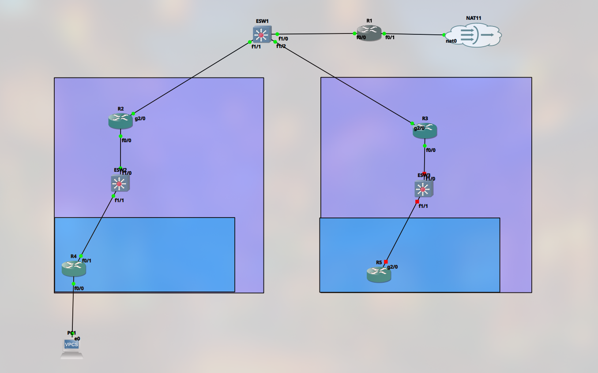

# Day 08 – Topology Redesign: Three-Tier Spine-Leaf Architecture

> **Date:** 08 Apr 2026 · **Topic:** Admitting the first "three-tier" design wasn't one, and rebuilding properly · **Takeaway:** The architecture that's good for learning is not the architecture that's good for an enterprise — and VLSM turns address waste into a design discipline.

[↑ Journal Index](../../README.md)

## Why redesign?


- The current design uses one edge router, 2 core routers, 2 distribution switches as well as routers at the final access layer.
- While suitable for learning purposes, this is not a true three tier architecture and also has many flaws such as the layer 3 routing at access layer.
- Meanwhile Enterprise networks prefer to use layer 2 at the access layer.

## Three-Tier Spine-leaf architecture



- The new topology follows the three tier network architecture.
	1. Core layer - ESW1 and ESW2
	2. Distribution layer - ESW3 and ESW4, ESW5 and ESW6
	3. Access layer - ESW7 to ESW14
- Meanwhile R1 and R2 act as two edge routers.

## VLSM

- The new network is subnetted from top to bottom using VLSM as follows.

| **Device** | **Interface** | **Network**       | **IP address**      | **Connected to** |
| ---------- | ------------- | ----------------- | ------------------- | ---------------- |
| R1         | loopback 0    | 10.0.0.1/32       | 10.0.0.1 /32        |                  |
|            | g2/0          | 192.168.122.0 /24 | 192.168.122.252 /24 | NAT 1            |
|            | f0/0          | 10.1.0.0 /30      | 10.1.0.1 /30        | ESW1 - f1/0      |
| R2         | loopback 0    | 10.0.0.2/32       | 10.0.0.2 /32        |                  |
|            | g2/0          | 192.168.122.0 /24 | 192.168.122.253 /24 | NAT 2            |
|            | f0/0          | 10.2.0.0 /16      | 10.2.0.1 /16        | ESW2 -f1/0       |
| ESW1       | loopback 0    | 10.0.0.10/32      | 10.0.0.10/32        |                  |
|            | f1/0          | 10.1.0.0 /30      | 10.1.0.2 /30        | R1 - f0/0        |
|            | f1/1          | 10.1.0.4 /30      | 10.1.0.5 /30        | ESW3 - f1/0      |
|            | f1/2          | 10.1.0.8 /30      | 10.1.0.9 /30        | ESW4 - f1/0      |
| ESW2       | loopback 0    | 10.0.0.20/32      | 10.0.0.20/32        |                  |
|            | f1/0          | 10.2.0.0 /30      | 10.2.0.2 /30        | R2 - f0/0        |
|            | f1/1          | 10.2.0.4 /30      | 10.2.0.5 /30        | ESW5 - f1/0      |
|            | f1/2          | 10.2.0.8 /30      | 10.2.0.9 /30        | ESW6 - f1/0      |
| ESW3       | loopback 0    | 10.0.0.30/32      | 10.0.0.30/32        |                  |
|            | f1/0          | 10.1.0.4 /30      | 10.1.0.6 /30        | ESW1 - f1/1      |
|            | f1/1          | 10.1.7.0 /24      | 10.1.7.1 /24        | ESW7 - f1/0      |
| ESW4       | loopback 0    | 10.0.0.40 /32     | 10.0.0.40 /32       |                  |
|            | f1/0          | 10.1.0.8 /30      | 10.1.0.10 /30       | ESW1 - f1/2      |
| ESW5       | loopback 0    | 10.0.0.50 /32     | 10.0.0.50 /32       |                  |
|            | f1/0          | 10.2.0.4 /30      | 10.2.0.6 /30        | ESW2 - f1/1      |
|            | f1/1          | 10.2.7.0 /24      | 10.2.7.1 /24        | ESW11 - f1/0     |
| ESW6       | loopback 0    | 10.0.0.60 /32     | 10.0.0.60 /32       |                  |
|            | f1/0          | 10.2.0.8 /30      | 10.2.0.10 /30       | ESW2 - f1/2      |

- The loopback 0 interfaces of each router and switch has been configured with an IP address from the 10.0.0.0 /24 address range. The loopback interface is a virtual interface that never shuts down because of a cable disconnection.
- The loopback interfaces are used for automation through ansible as well.
- With VLSM, the larger /16 networks 10.1.0.0 and 10.2.0.0 and 10.0.0.0 /24 networks have been subnetted according to IP address requirements at each segment.
- Ex:
	1. The links between two routers uses /30 networks which gives only two usable address. This matches the exact requirement of only two address between the two routers and complies with industry standards.
	2. The loopback interfaces use /32 addresses which only provide one single usable IP address, perfectly matching the requirement.
- The use of VLSM ensures that IP addresses aren't wasted unnecessarily.

## SSH configuration

- SSH configuration is done through a common template,

```bash
conf t
ip domain-name lab.local
crypto key generate rsa general-keys modulus 2048
username admin privilege 15 secret cisco
line vty 0 4
 transport input ssh
 login local
exit
ip ssh version 2
```

## OSPF

- In a massive network such as the newly redesigned network, static routing does not properly scale, makes management difficult as well as creates many points for possible human error.
- For these situations, dynamic routing isn't just an option, but almost a necessity.
- Therefore OSPF has been configured for routing between the many subnets.
- In single area OSPF, each router is configured to advertise their directly connected networks in the form of LSAs. A correctly configured OSPF network results in,

```text
R2#sh ip route
Codes: L - local, C - connected, S - static, R - RIP, M - mobile, B - BGP
      D - EIGRP, EX - EIGRP external, O - OSPF, IA - OSPF inter area
      N1 - OSPF NSSA external type 1, N2 - OSPF NSSA external type 2
      E1 - OSPF external type 1, E2 - OSPF external type 2
      i - IS-IS, su - IS-IS summary, L1 - IS-IS level-1, L2 - IS-IS level-2
      ia - IS-IS inter area, * - candidate default, U - per-user static route
      o - ODR, P - periodic downloaded static route, H - NHRP, l - LISP
      + - replicated route, % - next hop override

Gateway of last resort is not set

     10.0.0.0/8 is variably subnetted, 18 subnets, 3 masks
O       10.0.0.1/32 [110/2] via 10.0.0.13, 07:00:29, FastEthernet0/1
C       10.0.0.2/32 is directly connected, Loopback0
O       10.0.0.10/32 [110/3] via 10.0.0.13, 07:00:06, FastEthernet0/1
C       10.0.0.12/30 is directly connected, FastEthernet0/1
L       10.0.0.14/32 is directly connected, FastEthernet0/1
O       10.0.0.20/32 [110/2] via 10.2.0.2, 06:59:56, FastEthernet0/0
O       10.0.0.30/32 [110/4] via 10.0.0.13, 06:59:56, FastEthernet0/1
O       10.0.0.40/32 [110/4] via 10.0.0.13, 06:59:56, FastEthernet0/1
O       10.0.0.50/32 [110/3] via 10.2.0.2, 06:59:56, FastEthernet0/0
O       10.0.0.60/32 [110/3] via 10.2.0.2, 06:59:46, FastEthernet0/0
O       10.1.0.0/30 [110/2] via 10.0.0.13, 07:00:06, FastEthernet0/1
O       10.1.0.4/30 [110/3] via 10.0.0.13, 06:59:56, FastEthernet0/1
O       10.1.0.8/30 [110/3] via 10.0.0.13, 06:59:56, FastEthernet0/1
O       10.1.7.0/24 [110/4] via 10.0.0.13, 06:59:56, FastEthernet0/1
C       10.2.0.0/30 is directly connected, FastEthernet0/0
L       10.2.0.1/32 is directly connected, FastEthernet0/0
O       10.2.0.4/30 [110/2] via 10.2.0.2, 06:59:56, FastEthernet0/0
O       10.2.0.8/30 [110/2] via 10.2.0.2, 06:59:46, FastEthernet0/0
     192.168.122.0/24 is variably subnetted, 2 subnets, 2 masks
C       192.168.122.0/24 is directly connected, GigabitEthernet2/0
L       192.168.122.253/32 is directly connected, GigabitEthernet2/0
R2#
```

- As seen here, R2's routing table has OSPF entries for all the many networks advertised by every other router.

---
← [Day 07 · AI Implementation (LLM Showdown)](07-ai-implementation-llm-showdown.md) | [Day 09 · Ansible Day 1](09-ansible-first-playbook.md) →
