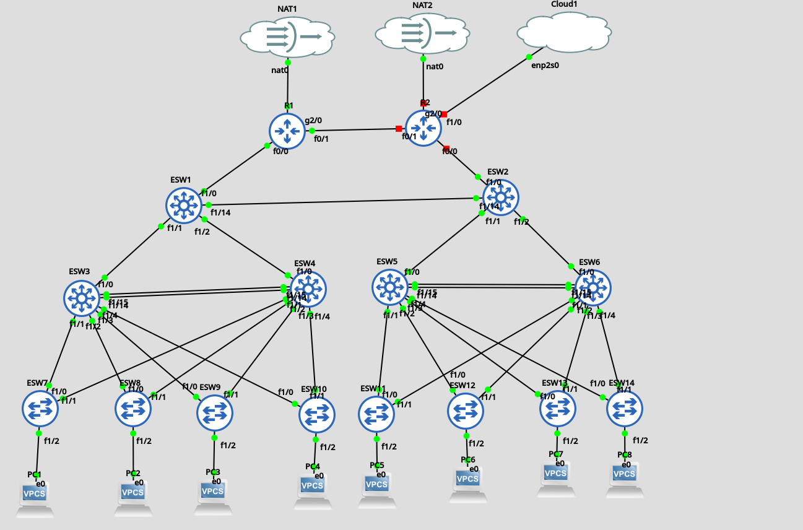

The final step of creating a fully self-healing three-tier network; redundancy at the core layer.

# Why?
- The topology upto now had one glaring weakness. It had two seperate networks that only answered to one Core switch and one Edge Router. 
- For example : 
	- ESW3,4,7-10 only communicated with ESW1 and R1
	- ESW5,6 11-14 only communicated with ESW 2 and R2.
- While the network does function perfectly as of now, there's a sigle issue. The moment ESW1 or 2 went down, that entire section of the network went down. There was no redundancy. No self healing.
# How...
## First thought -> Etherchannel
- Since the interfaces were available, and the core layer requires stability, the ability to handle routing for a large number of subnets and hence handle massive bandwith, the first thought I had was to use an ehterchannel link.
```ESW1(config)#int r fa1/10 - 11    
ESW1(config-if-range)#no swit  
ESW1(config-if-range)#no switchport    
ESW1(config-if-range)#  
Aug 11 14:08:51.800: %LINEPROTO-5-UPDOWN: Line protocol on Interface FastEthernet1/10, changed state to down  
ESW1(config-if-range)#chann  
ESW1(config-if-range)#chann?  
% Unrecognized command  
ESW1(config-if-range)#swit    
ESW1(config-if-range)#switchport    
ESW1(config-if-range)#chan  
ESW1(config-if-range)#channel-group    
Aug 11 14:09:16.000: %LINEPROTO-5-UPDOWN: Line protocol on Interface FastEthernet1/10, changed state to down  
ESW1(config-if-range)#channel-group
```
- However, unfortunately, after much troubleshooting and research, I found out that the IOS images used does not support layer 3 etherchannel groups. 
- Etherchannel has to be strictly layer 2.  As we can see, if the interfaces were changed into layer 3, the ehterchannel creation command **channel-group [number]** becomes unavailable.
- And since core layer is strictly layer 3; this was unacceptable. 
- Therefore Etherchannel was a failed attempt.

## Second, A Compromise -> A single link
- While a single link does not provide the myriad benefits of a ehterchannel group, due to the limitations of the images this was a compromise I had to take; as any redundancy and self healing is better than nothing.
### A simple link, A static route...
- At first, I simply created two networks 10.1.0.12 /30  and 10.2.0.12 /30 and assigned them to ESW1 and 2 respectively on FastEthernet14. 
- Then, with two static routes on each device I connected the two devices. However, then I realized that the desire to not couple the two core switches within a single shared network means I could no longer use OSPF.. And considering the amount of subnets I have created within this topology, the number of static routes that had to manually created turned out to be massive. Hence this idea was also scraped.
### OSPF and one happy link
- Therefore the new strategy was to create a single /30 network where both ESw1 and 2 had a directly connected route entry.
- Therefore, I created a single 10.1.0.12 /30 network and assigned 10.1.0.13 to ESW1 Fa1/14 and 10.1.0.14 to ESW2 Fa1/14.
- Then I advertised each route through OSPF with each core switch.
#### OSPF and Mannual Interfaces
- However, there was one issue. OSPF never converged.
- While troubleshooting I discovered the issue in,
```
ESW2#sh ip ospf neighbor    
  
Neighbor ID     Pri   State           Dead Time   Address         Interface  
10.0.0.60         1   FULL/DR         00:00:33    10.2.0.10       FastEthernet1/2  
10.0.0.50         1   FULL/DR         00:00:34    10.2.0.6        FastEthernet1/1  
ESW2#sh ip ospf interface br    
Interface    PID   Area            IP Address/Mask    Cost  State Nbrs F/C  
Fa1/2        1     0               10.2.0.9/30        1     BDR   1/1  
Fa1/1        1     0               10.2.0.5/30        1     BDR   1/1  
Fa1/0        1     0               10.2.0.2/30        1     DR    0/0  
Lo0          1     0               10.0.0.20/32       1     LOOP  0/0
```
- As we can see here, ESW1 and 2 never became OSPF neighbors, nor did Fa1/14 became an OSPF interface.
- To fix this, I had to mannually assign OSPF to an interface as so,
```
ESW2#conf t  
Enter configuration commands, one per line.  End with CNTL/Z.  
ESW2(config)#int fa1/14  
ESW2(config-if)#ip ospf 1 area 0  
ESW2(config-if)#  
.Aug 11 07:40:35.712: %OSPF-5-ADJCHG: Process 1, Nbr 10.0.0.10 on FastEthernet1/14 from LOADING to FULL, Loading Done
```
- Afterwards;
```
ESW2#sh ip ospf neighbor    
  
Neighbor ID     Pri   State           Dead Time   Address         Interface  
10.0.0.10         1   FULL/DR         00:00:35    10.1.0.13       FastEthernet1/14  
10.0.0.60         1   FULL/DR         00:00:38    10.2.0.10       FastEthernet1/2  
10.0.0.50         1   FULL/DR         00:00:39    10.2.0.6        FastEthernet1/1  
ESW2#sh ip ospf int br  
Interface    PID   Area            IP Address/Mask    Cost  State Nbrs F/C  
Fa1/14       1     0               10.1.0.14/30       1     BDR   1/1  
Fa1/2        1     0               10.2.0.9/30        1     BDR   1/1  
Fa1/1        1     0               10.2.0.5/30        1     BDR   1/1  
Fa1/0        1     0               10.2.0.2/30        1     DR    0/0  
Lo0          1     0               10.0.0.20/32       1     LOOP  0/0  
ESW2#
```

-  We have a full connection.
- And finally, even with R2 powered down, we can ping 10.2.99.14, the ip address of Access switch ESW14 under ESW2 section of the topology as packets are now routed through ESW2 > ESW1 > R1 > NAT
```
ping 10.2.99.14  
PING 10.2.99.14 (10.2.99.14) 56(84) bytes of data.  
64 bytes from 10.2.99.14: icmp_seq=1 ttl=251 time=167 ms  
64 bytes from 10.2.99.14: icmp_seq=2 ttl=251 time=142 ms  
64 bytes from 10.2.99.14: icmp_seq=3 ttl=251 time=158 ms  
64 bytes from 10.2.99.14: icmp_seq=4 ttl=251 time=143 ms  
64 bytes from 10.2.99.14: icmp_seq=5 ttl=251 time=208 ms  
^C  
--- 10.2.99.14 ping statistics ---  
5 packets transmitted, 5 received, 0% packet loss, time 4004ms  
rtt min/avg/max/mdev = 142.129/163.654/208.062/24.167 ms
```

```
traceroute 10.2.99.14  
traceroute to 10.2.99.14 (10.2.99.14), 30 hops max, 60 byte packets  
1  192.168.122.252 (192.168.122.252)  24.815 ms  24.791 ms  24.778 ms  
2  10.1.0.2 (10.1.0.2)  175.793 ms  206.000 ms  206.011 ms  
3  10.1.0.14 (10.1.0.14)  205.988 ms  236.046 ms  236.039 ms  
4  10.2.0.10 (10.2.0.10)  326.678 ms  326.678 ms  356.793 ms  
5  10.2.99.14 (10.2.99.14)  427.330 ms  427.326 ms *
```
- The traceroute further proves the now self healing nature of the network. 